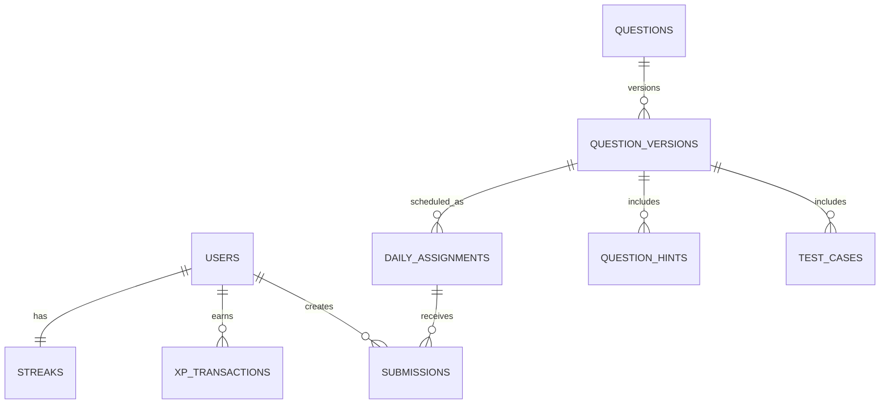

# Phase 0 Architecture Decisions

## Core user journeys

1. **Daily practice:** an authenticated user opens the dashboard, receives today's assignment for their level, opens the challenge, runs public tests, submits, then sees a persisted result and server-calculated progress.
2. **Question operations:** an admin creates a draft, supplies content, three hints, public and hidden tests, validates it, and schedules an immutable version for a future day.
3. **Recovery and trust:** a submission is idempotent; the API queues code for a sandbox worker. Only the backend calculates XP, streaks, and leaderboard score.

## Taxonomy and rules

| Level     | Focus                                                                                             |
| --------- | ------------------------------------------------------------------------------------------------- |
| Rookie    | variables, control flow, functions, strings, arrays, debugging                                    |
| Hacker    | hash maps, stacks/queues, recursion, sorting/searching, two pointers, sliding window, basic DP    |
| Architect | trees/graphs, advanced DP, backtracking, algorithms, SQL optimization, system design, concurrency |

MVP languages are Python and JavaScript. A solved daily challenge awards 100 base XP; first attempt and hint-use bonuses are configured server-side. A streak advances once per server calendar day after a successful daily solve; repeated submissions cannot advance it again. Leaderboard score is server calculated from correctness, attempts, difficulty, hints, and consistency.

## Roles

| Role        | Backend-enforced capabilities                      |
| ----------- | -------------------------------------------------- |
| User        | own account, challenges, submissions, progress     |
| Moderator   | reports and permitted moderation actions           |
| Admin       | question bank, schedules, users, analytics         |
| Super Admin | admin capabilities plus role and security settings |

## Wireframes

```text
Dashboard                    Challenge                    Result
+---------------------+      +------------------------+   +------------------+
| Streak | XP | Rank   |      | Title / level / topic  |   | Passed / Failed  |
| Today's challenge    | ---> | Statement + examples   |-->| Test breakdown   |
| Start challenge      |      | Monaco editor          |   | XP + streak      |
+---------------------+      | Run | Submit            |   | Learn next       |
                             +------------------------+   +------------------+

Admin console
+----------+-----------------------+
| Nav      | Metrics / schedule    |
| Questions| Question editor       |
| Calendar | tests / hints / audit |
+----------+-----------------------+
```

## ERD draft



Historical assignments and submissions reference `question_version_id`, never a mutable question alone. XP is an immutable ledger. The database schema and migrations begin in Phase 1.

## API contract

- All endpoints live beneath `/api/v1`; resource names are plural and use kebab-free, lowercase paths.
- Requests and responses use Pydantic models. Lists are paginated with `limit` and `cursor`.
- Mutating submission requests require an `Idempotency-Key` header.
- Errors use this envelope:

```json
{
  "error": {
    "code": "VALIDATION_ERROR",
    "message": "A human-readable explanation.",
    "request_id": "uuid"
  }
}
```

- Every request receives a correlation ID; clients may send `X-Request-ID` and receive it in the response.
